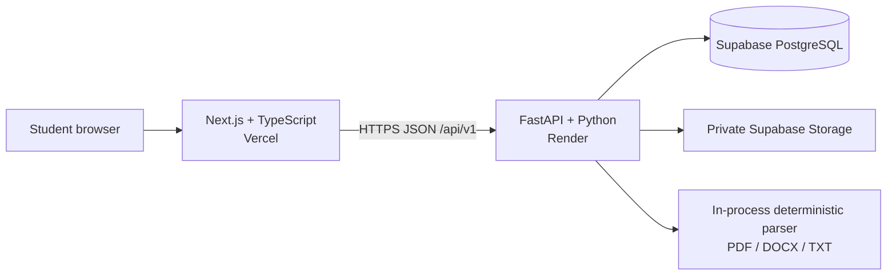

# CampusProof — Architecture and Data Design

## 1. Deployment topology

One frontend, one API, one relational database. Resume parsing and `cp-v1` scoring run in the API process synchronously for MVP-sized files. No queue, Redis, microservices, or paid AI dependency. The frontend uses fixtures for independent development and demos.

## 2. Component ownership

- **Frontend:** screens, interaction, client-side usability validation, typed API client, fixture adapter. Does not calculate authoritative score or eligibility.
- **API:** identity verification, authoritative validation, owner-scoped access, parser orchestration, scoring, persistence, signed file access, and OpenAPI.
- **Scoring module:** pure functions from normalized profile + role requirements + evidence to a versioned result. No database/network/UI dependencies.
- **Parser module:** file-type-specific extraction adapters return normalized text and warnings; separate analysis derives candidate sections/skills. Parse output remains unconfirmed until student review.
- **Database:** durable profile, evidence metadata, opportunity, assessment, and file metadata.
- **Storage provider:** private resume objects; random keys, short-lived access, explicit deletion.

## 3. Data model

All tables use UUID primary keys and UTC timestamps. Every user-owned table has an owner or parent relation that supports owner-constrained access.

| Table | Key fields and relationships |
|---|---|
| `users` | `id`, unique `auth_subject`, nullable email, timestamps; identity-provider subject only, no password storage |
| `student_profiles` | `id`, unique `user_id` FK, full name, branch, graduation year, nullable CGPA and declared scale, target role |
| `skills` | `id`, `profile_id` FK, normalized name, display name, optional self-reported level, source/evidence reference |
| `projects` | `id`, `profile_id` FK, title, description, optional URL, dates, timestamps |
| `opportunities` | `id`, `user_id` FK, company, role title, JD text, required/preferred skill terms, explicit CGPA/branch/year criteria |
| `assessments` | `id`, `user_id`, profile/opportunity FKs, eligibility result, readiness factors, role-match result, gaps/actions JSON, `scoring_version`, compact input snapshot, timestamp |
| `profile_files` | `id`, `user_id`, provider, private object key, sanitized filename, MIME, byte size, timestamp; never a public resume URL |

Use SQLAlchemy 2.x and Alembic. Add foreign keys, uniqueness, owner indexes, and explicit cascade/cleanup behavior. Apply schema changes through migrations. Avoid storing full resume text unless a feature requires it and retention is defined; prefer parsed facts and source references.

## 4. API and data flow

The route list and JSON shape are in `SRD.md`; FastAPI OpenAPI at `/openapi.json` is authoritative for frontend types.

1. Browser uploads a resume through short-lived authorization or an API-bounded upload, then requests parsing.
2. Parser returns candidate facts/warnings; browser asks the student to review and confirm.
3. Frontend sends normalized profile and opportunity data. API validates identity, bounds, and ownership.
4. Scoring module returns eligibility, `cp-v1` factor results, role match, evidence confidence, gaps, and actions.
5. API persists a snapshot and response in one transaction, then returns the same result contract.
6. Frontend renders the response without recomputing the result.

## 5. Parsing and scoring boundaries

Accept PDF, DOCX, and TXT in the hosted MVP; reject files above 5 MiB. Validate extension and content/signature where possible. Treat input as untrusted, limit parser work, and never execute embedded content. Parser errors use stable codes and do not erase profile data.

Normalize skill terms through a small version-controlled alias map. Keep unknown JD terms in the response instead of dropping them. Assessment functions are deterministic, versioned (`cp-v1`), and side-effect free; persistence occurs outside the scoring function. Factor weights and edge cases are fixed in `SRD.md`.

## 6. Auth and ownership

Use Supabase Auth because it fits the agreed deployment and avoids implementing passwords. API validates token signature, issuer, audience, expiry, and subject. It maps the subject to `users.id`, then adds the owner predicate to every read/write. Never trust a user ID in request JSON, query parameters, or a file key. Guest demo mode contains synthetic fixtures only and does not call persistence routes.

## 7. Provider configuration

- Use Supabase PostgreSQL + Supabase Auth + private Supabase Storage; use TLS and separate preview/production projects.
- Keep storage access behind a narrow service boundary for testing, but do not build multi-provider failover.
- Use separate Vercel and Render preview/production settings; previews never use production student data.
