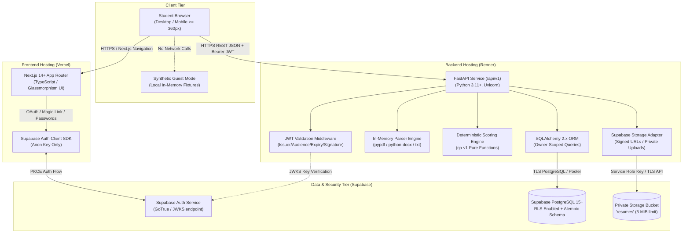
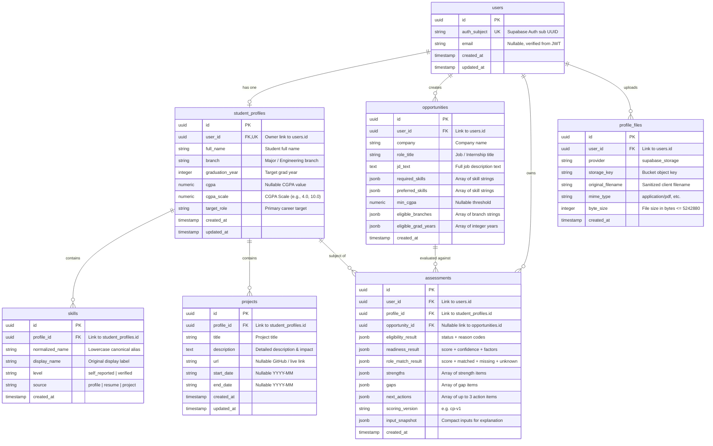
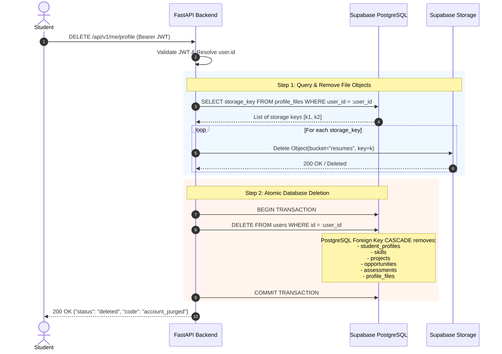
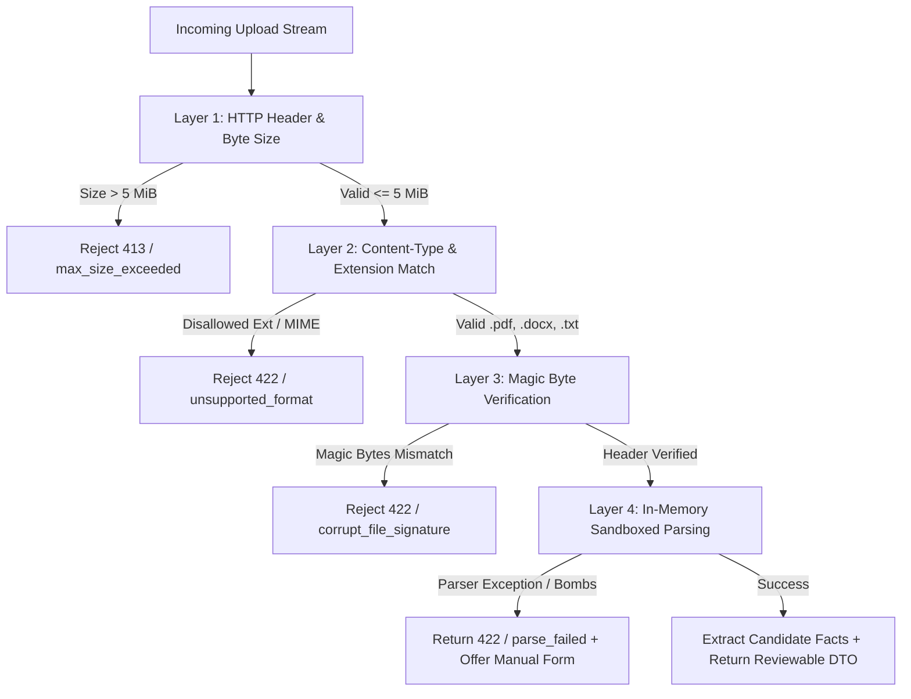
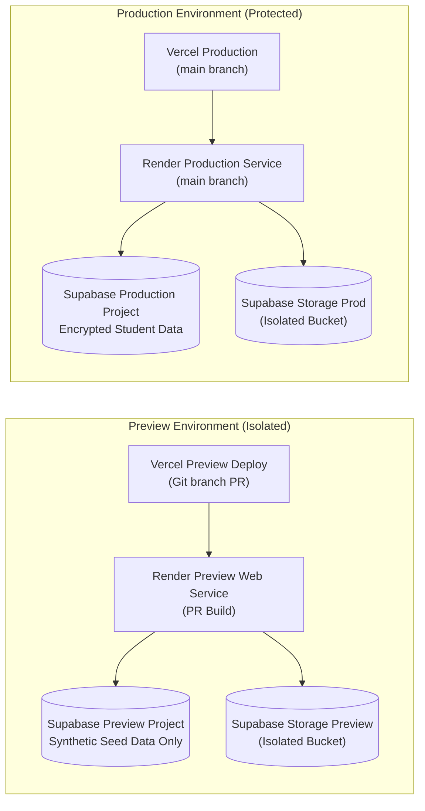

# Sejal — Phase 07: System, Security, and Data Design Validation

**Owner:** Sejal Kumari (System Design Engineer)  
**Project:** PlacementOS (Product Name: CampusProof)  
**Status:** VALIDATED & READY FOR IMPLEMENTATION REVIEW  
**Classification:** Canonical Architecture, Security, and Data Design Specification

---

## 1. Validation Outcome

Phase 07 validates that the system architecture, relational data model, authentication/authorization boundaries, privacy safeguards, and deployment topologies are internally consistent, secure by design, and fully decoupled for parallel implementation across frontend, backend, and platform workstreams.

### Validation Summary

| Domain | Status | Key Validation Finding |
|---|---|---|
| **Architecture Topology** | **VALIDATED** | Clean separation: Next.js (Vercel) + FastAPI (Render) + Supabase (PostgreSQL, Auth, Storage). Zero microservices/queues/Redis required for MVP. |
| **Data Schema & Ownership** | **VALIDATED** | Every table has strict UUID primary keys, user ownership relations, explicit delete cascades, and feature traceability. |
| **Authentication & Authorization** | **VALIDATED** | Defense-in-depth: Supabase JWT validation on Render FastAPI (issuer/audience/subject) + server-side owner filtering + Supabase PostgreSQL RLS policies. |
| **Resume Storage & Upload Security** | **VALIDATED** | Private bucket, strict MIME/magic-byte validation, 5 MiB ceiling, random UUID storage keys, and zero durable raw resume text storage. |
| **Scoring & Privacy Determinism** | **VALIDATED** | Pure deterministic `cp-v1` heuristic scoring; complete separation between eligibility hard rules, readiness coaching score, and role matching; zero LLM dependency in critical path. |
| **Migration & Deployment Safety** | **VALIDATED** | Alembic versioned migrations with expand-contract patterns, strict preview/production project isolation, and synthetic preview datasets. |

---

## 2. Canonical Architecture

### 2.1 System Topology Diagram



### 2.2 Service Boundaries & Responsibilities

1. **Frontend (Vercel / Next.js):**
   - Renders responsive UI, forms, and glassmorphism results dashboard.
   - Manages client-side session via Supabase Auth client (`NEXT_PUBLIC_SUPABASE_ANON_KEY`).
   - Translates API errors into actionable user states.
   - Operates fully in offline/demo mode when `NEXT_PUBLIC_DEMO_MODE=true` using static fixtures.
   - **Prohibited:** Computing authoritative scores, evaluating eligibility, holding database credentials, or holding the Supabase `service_role` key.

2. **Backend (Render / FastAPI):**
   - Authoritative business logic, validation, and domain orchestration.
   - Verifies incoming Supabase JWTs (`AUTH_ISSUER_URL`, `AUTH_AUDIENCE`).
   - Executes in-memory resume parsing (`pypdf`, `python-docx`, `utf-8` text).
   - Runs deterministic, pure `cp-v1` scoring and rule evaluation.
   - Enforces owner-scoped database queries on every persistence endpoint.
   - Generates short-lived signed URLs for resume downloads.
   - **Prohibited:** Trusting client-supplied user IDs, writing raw resume text to persistent logs, or exposing raw provider/database stack traces.

3. **Database (Supabase PostgreSQL):**
   - Relational store of record for users, profiles, skills, projects, opportunities, and assessments.
   - Enforces referential integrity (foreign keys, uniqueness, cascade deletions).
   - Provides Row Level Security (RLS) policies as a secondary defense layer behind FastAPI owner predicates.

4. **Object Storage (Supabase Private Storage):**
   - Stores raw uploaded resumes under randomized object keys (`{user_id}/{uuid}.{ext}`).
   - Bucket configured as strictly **private** (zero public read access).
   - Enforces 5 MiB file size ceiling and MIME-type restrictions.

---

## 3. Architecture & SRD Conflict Resolution

| Item | Existing Conflict / Ambiguity | Resolution & Canonical Decision | Impacted Scope |
|---|---|---|---|
| **Project Naming** | Repo named `PlacementOS`, docs mention `CampusProof` and `ResumeSignal`. | **Canonical Name:** `PlacementOS` is the overarching repository and project platform. `CampusProof` is the student-facing product name used in UI and docs. `ResumeSignal` refers strictly to the in-memory parsing submodule. | UI copy, Documentation |
| **Database Connection Mode** | `DEPLOYMENT.md` discusses IPv6 direct vs IPv4 session pooler. | **Decision:** Render connections to Supabase PostgreSQL MUST use the **Session pooler** (`port 5432` with SSL enabled) or direct connection if IPv6 is supported. **Transaction pooling (`port 6543`) is prohibited** for SQLAlchemy ORM unless prepared statements are explicitly disabled. | Backend `DATABASE_URL` |
| **RLS vs Service-Role Key** | FastAPI uses `SUPABASE_SERVICE_ROLE_KEY` which bypasses PostgreSQL RLS. | **Decision:** Defense-in-depth architecture. Primary authorization is enforced via **explicit owner predicates** in SQLAlchemy queries (`WHERE user_id = :authenticated_user_id`). RLS policies are deployed on all tables as defense against accidental direct client queries or compromised anon keys. | FastAPI Persistence, DB Schema |
| **Resume Text Persistence** | Ambiguity over whether parsed resume text is stored in `profile_files` or `student_profiles`. | **Decision:** Raw resume full-text is **NEVER** stored in PostgreSQL. Only structured candidate facts (skills, projects, education) and file metadata (`filename`, `mime_type`, `byte_size`, `storage_key`) are persisted upon student confirmation. | Privacy, Database Schema |
| **Eligibility vs Readiness Coupling** | Risk of treating academic criteria (CGPA/branch) as score penalties. | **Decision:** Hard eligibility is strictly decoupled from `cp-v1` readiness calculation. Failed eligibility yields `eligibility.status = not_eligible` with explicit reasons, while readiness score evaluates demonstrated evidence independently. | Scoring Module, UI Dashboard |
| **Guest Demo Persistence** | Handling demo interactions without an account. | **Decision:** Guest demo mode is 100% client-side/in-memory using static fixtures. Zero network calls to persistence endpoints; no transient guest records created in Supabase. | Frontend, Backend API |

---

## 4. Data-Model Validation & Schema Specification

All tables use standard UUID primary keys generated by `gen_random_uuid()` and UTC timestamps.

### 4.1 Relational Schema



### 4.2 Entity Field Traceability & Validation Matrix

| Table | Column | Type | Constraints / Indexes | Feature Traceability | Privacy / Security Implication | Deletion Rule |
|---|---|---|---|---|---|---|
| `users` | `id` | `UUID` | `PK, DEFAULT gen_random_uuid()` | Internal identity anchor | PII root; internal identifier | Cascade target |
| `users` | `auth_subject` | `VARCHAR(64)` | `UNIQUE, NOT NULL, INDEX` | Supabase Auth mapping | Auth identifier (sub claim) | Cascade delete |
| `users` | `email` | `VARCHAR(255)` | `NULLABLE` | Account notification/audit | PII: email address | Cascade delete |
| `student_profiles` | `id` | `UUID` | `PK, DEFAULT gen_random_uuid()` | Profile management (J1) | Profile identity | Cascade delete |
| `student_profiles` | `user_id` | `UUID` | `UNIQUE, NOT NULL, FK(users.id), INDEX` | User-to-Profile 1:1 bond | Direct ownership | `ON DELETE CASCADE` |
| `student_profiles` | `full_name` | `VARCHAR(128)` | `NOT NULL` | Profile UI & assessment (J1) | PII: student name | Cascade delete |
| `student_profiles` | `branch` | `VARCHAR(64)` | `NOT NULL, INDEX` | Eligibility matching (J3) | Academic metadata | Cascade delete |
| `student_profiles` | `graduation_year`| `INTEGER` | `NOT NULL, INDEX` | Eligibility matching (J3) | Academic metadata | Cascade delete |
| `student_profiles` | `cgpa` | `NUMERIC(4,2)`| `NULLABLE` | Explicit eligibility check | Academic PII (optional) | Cascade delete |
| `student_profiles` | `cgpa_scale` | `NUMERIC(4,2)`| `NULLABLE, DEFAULT 10.0` | Academic score normalization | Scale context | Cascade delete |
| `student_profiles` | `target_role` | `VARCHAR(128)` | `NOT NULL, INDEX` | Role-readiness target (J3) | User career preference | Cascade delete |
| `skills` | `id` | `UUID` | `PK, DEFAULT gen_random_uuid()` | Skill inventory (J1, J3) | None | Cascade delete |
| `skills` | `profile_id` | `UUID` | `NOT NULL, FK(student_profiles.id), INDEX` | Profile relation | Scoped to profile | `ON DELETE CASCADE` |
| `skills` | `normalized_name`| `VARCHAR(64)` | `NOT NULL, INDEX` | Matching against taxonomy | Technical skill tag | Cascade delete |
| `skills` | `source` | `VARCHAR(32)` | `NOT NULL` | Provenance tracking | Provenance metadata | Cascade delete |
| `projects` | `id` | `UUID` | `PK, DEFAULT gen_random_uuid()` | Project evidence (J1, J4) | None | Cascade delete |
| `projects` | `profile_id` | `UUID` | `NOT NULL, FK(student_profiles.id), INDEX` | Profile relation | Scoped to profile | `ON DELETE CASCADE` |
| `projects` | `title` | `VARCHAR(128)` | `NOT NULL` | Project verification | Project metadata | Cascade delete |
| `projects` | `description` | `TEXT` | `NOT NULL` | Factor scoring evidence | Student project detail | Cascade delete |
| `projects` | `url` | `VARCHAR(512)` | `NULLABLE` | External evidence link | External link | Cascade delete |
| `opportunities` | `id` | `UUID` | `PK, DEFAULT gen_random_uuid()` | Opportunity evaluation (J3) | Target job data | Cascade delete |
| `opportunities` | `user_id` | `UUID` | `NOT NULL, FK(users.id), INDEX` | Student-owned target JD | Scoped to student | `ON DELETE CASCADE` |
| `opportunities` | `jd_text` | `TEXT` | `NOT NULL` | Role matching input | Raw JD content | Cascade delete |
| `opportunities` | `min_cgpa` | `NUMERIC(4,2)`| `NULLABLE` | Hard eligibility check | Explicit threshold | Cascade delete |
| `assessments` | `id` | `UUID` | `PK, DEFAULT gen_random_uuid()` | Assessment history (J4) | Assessment record | Cascade delete |
| `assessments` | `user_id` | `UUID` | `NOT NULL, FK(users.id), INDEX` | Student assessment access | Student report | `ON DELETE CASCADE` |
| `assessments` | `scoring_version`| `VARCHAR(16)` | `NOT NULL` | Auditability & replay | Algorithmic version | Cascade delete |
| `assessments` | `input_snapshot` | `JSONB` | `NOT NULL` | Audit & explainability | Full assessment inputs | Cascade delete |
| `profile_files` | `id` | `UUID` | `PK, DEFAULT gen_random_uuid()` | Resume tracking (J2) | None | Cascade delete |
| `profile_files` | `user_id` | `UUID` | `NOT NULL, FK(users.id), INDEX` | Resume file ownership | Storage reference | `ON DELETE CASCADE` |
| `profile_files` | `storage_key` | `VARCHAR(255)` | `NOT NULL, UNIQUE` | Storage bucket object link | Object locator | Cascade delete + S3 delete |

---

## 5. Ownership Model & Multi-Tenant Isolation

### 5.1 Identity Mapping Flow

1. Client signs in with Supabase Auth (e.g. Email/Password, Magic Link, GitHub OAuth).
2. Client receives JWT containing claims:
   - `iss`: `https://<supabase-project-ref>.supabase.co/auth/v1`
   - `aud`: `authenticated`
   - `sub`: `<supabase-user-uuid>`
   - `email`: `student@university.edu`
3. Client passes JWT in `Authorization: Bearer <token>` to FastAPI on Render.
4. FastAPI `get_current_user` dependency:
   - Decodes and validates JWT against Supabase Auth public keys (JWKS / secret).
   - Verifies `exp > now()` and `aud == "authenticated"`.
   - Queries `users` table: `SELECT id FROM users WHERE auth_subject = :sub`.
   - If not found, provisions record in `users` (JIT user synchronization).
   - Returns internal `User` object (`user.id`).
5. All downstream service queries MUST use `WHERE user_id = :user.id` or `WHERE profile_id IN (SELECT id FROM student_profiles WHERE user_id = :user.id)`.

### 5.2 Anti-Tampering Rules

- **Zero Client Trust:** Never bind to client-provided `user_id`, `profile_id`, or `owner_id` in request payloads.
- **Uniform 404 on Cross-Tenant Access:** If a user attempts `GET /api/v1/assessments/{foreign_uuid}`, the API must return `404 Not Found` (never `403 Forbidden`) to prevent resource existence enumeration.

---

## 6. Deletion & Data Retention Policy

### 6.1 Two-Phase Cascading Deletion Workflow

When `DELETE /api/v1/me/profile` is triggered:



### 6.2 Partial Cleanup & Idempotent Retry Safeguards

- If Supabase Storage object deletion fails due to transient network error, the transaction logs an alert with `storage_key` and proceeds with database deletion, returning a 200 status with warning metadata.
- A scheduled background cleanup task checks for orphaned storage objects (`storage_key` without matching `profile_files` record) and purges them safely.

---

## 7. Authentication & Authorization Specification

### 7.1 JWT Validation Pipeline (FastAPI)

```python
# Specification for FastAPI Authentication Guard
# Module: app/core/auth.py

# Validation Requirements:
# 1. Algorithm: RS256 (via Supabase JWKS) or HS256 (via Supabase JWT Secret)
# 2. Issuer verification: match https://<SUPABASE_PROJECT_REF>.supabase.co/auth/v1
# 3. Audience verification: match "authenticated"
# 4. Clock skew tolerance: maximum 60 seconds
# 5. Token revocation / Expiry check: reject expired tokens immediately (HTTP 401)
```

### 7.2 Auth Error Handling Matrix

| Scenario | HTTP Code | Error Code | Response Detail |
|---|---|---|---|
| Missing `Authorization` header | `401` | `auth_header_missing` | `"Authentication credentials were not provided."` |
| Expired JWT token | `401` | `token_expired` | `"Your session has expired. Please sign in again."` |
| Invalid signature / Corrupt token | `401` | `invalid_token` | `"Invalid authentication token."` |
| Mismatched issuer / audience | `401` | `invalid_claims` | `"Token claims validation failed."` |
| Resource owned by another user | `404` | `not_found` | `"The requested resource was not found."` |
| Payload schema validation failure | `422` | `validation_error` | Field-specific Pydantic error details |

---

## 8. Row Level Security (RLS) Strategy

As a defense-in-depth measure, Row Level Security is enabled across all tables in Supabase PostgreSQL:

```sql
-- Canonical RLS Policies Specification
ALTER TABLE users ENABLE ROW LEVEL SECURITY;
ALTER TABLE student_profiles ENABLE ROW LEVEL SECURITY;
ALTER TABLE skills ENABLE ROW LEVEL SECURITY;
ALTER TABLE projects ENABLE ROW LEVEL SECURITY;
ALTER TABLE opportunities ENABLE ROW LEVEL SECURITY;
ALTER TABLE assessments ENABLE ROW LEVEL SECURITY;
ALTER TABLE profile_files ENABLE ROW LEVEL SECURITY;

-- 1. users: user can only select/update their own record
CREATE POLICY users_owner_policy ON users
  FOR ALL USING (auth_subject = auth.uid()::text);

-- 2. student_profiles: scoped via users.id
CREATE POLICY profiles_owner_policy ON student_profiles
  FOR ALL USING (user_id IN (SELECT id FROM users WHERE auth_subject = auth.uid()::text));

-- 3. skills & projects: scoped via profile_id
CREATE POLICY skills_owner_policy ON skills
  FOR ALL USING (profile_id IN (
    SELECT sp.id FROM student_profiles sp 
    JOIN users u ON sp.user_id = u.id 
    WHERE u.auth_subject = auth.uid()::text
  ));

CREATE POLICY projects_owner_policy ON projects
  FOR ALL USING (profile_id IN (
    SELECT sp.id FROM student_profiles sp 
    JOIN users u ON sp.user_id = u.id 
    WHERE u.auth_subject = auth.uid()::text
  ));

-- 4. opportunities, assessments, profile_files: scoped directly via user_id
CREATE POLICY opps_owner_policy ON opportunities
  FOR ALL USING (user_id IN (SELECT id FROM users WHERE auth_subject = auth.uid()::text));

CREATE POLICY assessments_owner_policy ON assessments
  FOR ALL USING (user_id IN (SELECT id FROM users WHERE auth_subject = auth.uid()::text));

CREATE POLICY files_owner_policy ON profile_files
  FOR ALL USING (user_id IN (SELECT id FROM users WHERE auth_subject = auth.uid()::text));
```

---

## 9. Upload & Resume Analysis Security

### 9.1 Multi-Layer File Validation Pipeline



### 9.2 File Signature Rules

| Format | Allowed Extensions | Expected MIME Type | Magic Bytes / Header Signature |
|---|---|---|---|
| **PDF** | `.pdf` | `application/pdf` | Starts with `%PDF-` (`0x25 0x50 0x44 0x46 0x2D`) |
| **DOCX** | `.docx` | `application/vnd.openxmlformats-officedocument.wordprocessingml.document` | Starts with PK Zip Header `PK\x03\x04` (`0x50 0x4B 0x03 0x04`) |
| **Plain Text**| `.txt` | `text/plain` | Valid UTF-8 / ASCII byte sequence, zero null bytes (`0x00`) |

### 9.3 In-Memory Parser Protections

- **Zero Macro/Script Execution:** Parsers treat documents as inert binary streams. Active scripts, OLE objects, or embedded executables are ignored.
- **Decompression Bomb Limits:** Uncompressed stream memory is capped at 25 MiB.
- **No Durable Raw-Text Storage:** Parsed text exists in memory only during parsing and is discarded after candidate fact extraction.

---

## 10. CORS & Secret Handling

### 10.1 CORS Policy Rules

- **Allowed Origins:** Strictly matched to environment configuration:
  - **Local:** `http://localhost:3000`, `http://127.0.0.1:3000`
  - **Preview:** Exact Vercel preview URLs, or scoped regex `https://*-<team-slug>.vercel.app`
  - **Production:** Canonical domain (e.g. `https://placementos.vercel.app`)
- **Allowed Methods:** `GET`, `POST`, `PUT`, `DELETE`, `OPTIONS`
- **Allowed Headers:** `Content-Type`, `Authorization`, `X-Request-ID`
- **Disallowed:** Wildcard `*` in production with credentials enabled.

### 10.2 Secret Segregation Matrix

| Secret / Config Key | Allowed in Browser (`frontend`)? | Allowed in Server (`backend`)? | Where Managed |
|---|---|---|---|
| `NEXT_PUBLIC_SUPABASE_URL` | YES | NO | Vercel Environment Variables |
| `NEXT_PUBLIC_SUPABASE_ANON_KEY` | YES | NO | Vercel Environment Variables |
| `NEXT_PUBLIC_API_BASE_URL` | YES | NO | Vercel Environment Variables |
| `NEXT_PUBLIC_DEMO_MODE` | YES | NO | Vercel Environment Variables |
| `SUPABASE_SERVICE_ROLE_KEY` | **NEVER** | YES | Render Environment Secrets |
| `DATABASE_URL` | **NEVER** | YES | Render Environment Secrets |
| `AUTH_ISSUER_URL` | **NEVER** | YES | Render Environment Variables |
| `AUTH_AUDIENCE` | **NEVER** | YES | Render Environment Variables |
| `SUPABASE_STORAGE_BUCKET` | **NEVER** | YES | Render Environment Variables |

---

## 11. Database Migration Strategy & Lifecycle

### 11.1 Migration Ownership & Tooling

- **Migration Tool:** Alembic (Python) in `backend/migrations/`.
- **Migration Owner:** Backend Engineer (Aarush), reviewed and approved by System Design (Sejal).
- **Execution Lifecycle:** Migrations are applied in the Render release step or manual pre-deployment phase **prior** to cutting traffic to new application containers.

### 11.2 Zero-Downtime Expand-and-Contract Policy

1. **Phase 1 (Expand):** Add new nullable columns or tables. Deploy migration.
2. **Phase 2 (Dual-Write/Read):** Deploy application code reading from new fields with fallback.
3. **Phase 3 (Contract):** Backfill data, add `NOT NULL` constraints, drop obsolete columns in a separate subsequent migration.

### 11.3 Destructive Migration Safeguards

- No `DROP TABLE`, `DROP COLUMN`, or `TRUNCATE` operations are permitted in standard feature PRs.
- Any destructive operation requires an explicit ADR, database snapshot backup, and off-peak execution plan.
- Point-in-Time Recovery (PITR) is verified active on Supabase production.

---

## 12. Score & Eligibility Validation (`cp-v1`)

### 12.1 Formula & Factor Breakdown

The `cp-v1` readiness score is a strictly deterministic weighted average (0–100 integer):

$$\text{Readiness Score} = \text{round}\left( \frac{\sum_{\text{available}} (\text{score}_i \times \text{weight}_i)}{\sum_{\text{available}} \text{weight}_i} \right)$$

| Factor Key | Canonical Weight | Supporting Evidence & Rules |
|---|---|---|
| `role_skill_coverage` | **30%** | Explicit role/JD skills mapped to student skills & evidence. |
| `demonstrated_project_evidence` | **25%** | Projects, work experience with descriptions, metrics, and URLs. |
| `resume_clarity_completeness` | **20%** | Structural completeness (sections, dates, contact); no formatting bias. |
| `technical_skill_evidence` | **15%** | Student claims corroborated by project/resume mentions. |
| `profile_completeness` | **10%** | Presence of essential profile attributes (branch, grad year, role). |

### 12.2 Hard Eligibility Isolation Rules

- **Status Enum:** Exactly `eligible`, `not_eligible`, or `unknown`.
- **Decoupled Arithmetic:** Academic thresholds (CGPA, branch, grad year) apply **only** to eligibility evaluation. CGPA is never used as a readiness score penalty.
- **Unknown Integrity:** If a requirement is missing from the student profile (e.g. CGPA omitted), status is `unknown` with code `cgpa_missing`. It is never guessed or assumed failed unless another explicit rule triggers `not_eligible`.

### 12.3 Evidence Provenance Hierarchy

$$\text{self\_reported} < \text{resume\_mentioned} < \text{project\_described} < \text{externally\_verified}$$

---

## 13. Privacy-Path & PII Inventory

| Personal Data Element | Collection Point | In-Transit Protection | At-Rest Storage | Retention / Deletion | Owner Verification |
|---|---|---|---|---|---|
| **Student Full Name** | Profile Form (J1) / Resume | TLS 1.3 | Encrypted PostgreSQL | Purged on profile delete | `WHERE user_id = :uid` |
| **Email Address** | Supabase Auth (J1) | TLS 1.3 | Supabase Auth DB | Purged on auth delete | JWT subject check |
| **Academic Records (CGPA)** | Profile Form (J1) | TLS 1.3 | Encrypted PostgreSQL | Purged on profile delete | `WHERE user_id = :uid` |
| **Raw Resume Document** | Resume Upload (J2) | TLS 1.3 | Supabase Private Bucket | Purged on profile delete | Random key + API signing |
| **Projects & Skills** | Profile Form / Parse (J1,J2)| TLS 1.3 | Encrypted PostgreSQL | Purged on profile delete | `WHERE profile_id IN (...)` |
| **Assessment History** | Assessment Run (J4) | TLS 1.3 | Encrypted PostgreSQL | Purged on profile delete | `WHERE user_id = :uid` |

---

## 14. Preview Environment Isolation



- **Zero Cross-Contamination:** Preview services never connect to the production Supabase project.
- **Synthetic Test Data:** Previews are seeded with synthetic student fixtures only. Real student PII is strictly prohibited in preview/testing environments.

---

## 15. Risk Register

| Risk ID | Risk Description | Likelihood | Impact | Mitigation Strategy | Owner |
|---|---|---|---|---|---|
| **RSK-01** | Cross-Account Data Access via ID manipulation | Low | Critical | Strict server-side `user_id` filtering from validated JWT; uniform 404 responses; PostgreSQL RLS policies. | Sejal / Aarush |
| **RSK-02** | Malicious / Bomb Uploads in Resume Parser | Medium | High | 5 MiB size cap; magic byte inspection; 25 MiB memory sandbox; inert text extraction without macro execution. | Aarush |
| **RSK-03** | Exposure of Supabase `service_role` Key | Low | Critical | Key restricted to Render server secrets; linting rules to prevent client bundle inclusion (`NEXT_PUBLIC_`). | Sarthak / Sejal |
| **RSK-04** | Incomplete Account Deletion (Orphaned Files) | Medium | Medium | Two-phase deletion with storage purge before DB commit; periodic background orphan sweeper task. | Aarush / Sejal |
| **RSK-05** | Destructive Database Migration Data Loss | Low | High | Expand-and-contract migration policy; automated Supabase PITR backups; preview migration dry-runs. | Aarush / Sejal |
| **RSK-06** | Student PII Leaked in Application Logs | Medium | High | Strict log sanitizers; prohibition of raw resume text, JWT tokens, and PII payload logging. | Aarush |
| **RSK-07** | Non-Deterministic or Hallucinated Scoring | Low | High | Pure function `cp-v1` scoring; comprehensive boundary unit tests; zero LLM calls in core scoring path. | Aarush |

---

## 16. Production Launch Checklist & Gates

- [ ] **Gate 1: Architecture & Contracts**
  - [ ] OpenAPI specification fully matches `SRD.md` `/api/v1` routes and schemas.
  - [ ] Health endpoints `/health/live` and `/health/ready` operational on Render.
- [ ] **Gate 2: Security & Identity**
  - [ ] Supabase Auth JWT verification enforced on all `/api/v1/me/*`, `/resumes/*`, `/opportunities/*`, and `/assessments/*` endpoints.
  - [ ] RLS policies enabled and verified on all Supabase PostgreSQL tables.
  - [ ] CORS headers restricted strictly to production Vercel domain.
  - [ ] No service keys or DB credentials present in client-side bundles.
- [ ] **Gate 3: Data & Storage**
  - [ ] Supabase `resumes` storage bucket configured as strictly private.
  - [ ] File upload constraints (5 MiB, MIME, magic bytes) validated with unit tests.
  - [ ] Cascading deletion verified end-to-end (DB rows + Storage objects).
- [ ] **Gate 4: Scoring & Engine**
  - [ ] `cp-v1` deterministic calculation tests pass with 100% factor boundary coverage.
  - [ ] Eligibility status is completely decoupled from readiness score arithmetic.
- [ ] **Gate 5: Operations & Disaster Recovery**
  - [ ] Alembic migration suite executes cleanly against clean database.
  - [ ] Daily backups and Point-in-Time Recovery (PITR) configured in Supabase.
  - [ ] Synthetic preview environment verified isolated from production.

---

## 17. Architecture Decision Records (ADRs)

### ADR-001: Monolithic FastAPI Service on Render with Next.js on Vercel
- **Status:** Accepted
- **Context:** The system requires high agility, simple deployment, and zero operational overhead for MVP.
- **Decision:** Deploy frontend as Next.js 14+ on Vercel and backend as a single FastAPI Python service on Render. Avoid microservices, Celery/Redis queues, or serverless functions for the MVP.
- **Consequences:** Low infrastructure complexity, simplified debugging, fast iteration.

### ADR-002: Supabase Auth JWT Verification with Server-Enforced Ownership
- **Status:** Accepted
- **Context:** Student data must be private and secure without building custom password auth.
- **Decision:** Delegate identity authentication to Supabase Auth. FastAPI verifies JWT claims and resolves internal `user.id`. Every database operation strictly enforces owner predicates.
- **Consequences:** Eliminates password management risks; provides secure, standardized token validation.

### ADR-003: Row Level Security (RLS) as Defense-in-Depth
- **Status:** Accepted
- **Context:** FastAPI connects to Supabase PostgreSQL using service credentials, which bypass RLS by default.
- **Decision:** Implement RLS policies on all tables matching `auth.uid()`. FastAPI enforces owner filters in SQLAlchemy queries, while RLS prevents leaks if direct DB access is ever granted.
- **Consequences:** Multi-layered security posture.

### ADR-004: In-Memory Resume Parsing Without Durable Raw Text Storage
- **Status:** Accepted
- **Context:** Storing raw extracted resume text indefinitely introduces PII liability and privacy risks.
- **Decision:** Resumes are parsed in-memory during upload review. Only confirmed structured candidate facts are saved in PostgreSQL; raw resume text is never persisted in the database.
- **Consequences:** Maximum student privacy, reduced storage footprint, lower PII attack surface.

### ADR-005: Deterministic `cp-v1` Heuristic Engine (No LLM in Core Loop)
- **Status:** Accepted
- **Context:** University placement readiness scoring requires transparent, explainable, and reproducible results.
- **Decision:** The core scoring engine is built as pure deterministic mathematical functions (`cp-v1`). LLMs are strictly forbidden from calculating scores or inventing evidence.
- **Consequences:** Zero API cost, sub-second latency, zero hallucinations, full auditability.

### ADR-006: Atomic Two-Phase Account Deletion
- **Status:** Accepted
- **Context:** Students must have the right to completely purge their profiles and uploaded documents.
- **Decision:** Deletion purges private storage objects first, followed by an atomic `ON DELETE CASCADE` transaction in PostgreSQL.
- **Consequences:** Clean data purging with no orphaned personal data.

### ADR-007: Database Migrations via Alembic with Isolated Environments
- **Status:** Accepted
- **Context:** Schema changes must be reproducible and safe across preview and production.
- **Decision:** Use Alembic in `backend/` for all schema migrations. Maintain completely separate Supabase projects for preview and production.
- **Consequences:** Prevents accidental data corruption or schema drifts between environments.

---

## 18. Phase 07 Acceptance Checklist

- [x] Architecture and SRD conflicts are identified, resolved, and documented in Markdown.
- [x] Data ownership model is documented with field-by-field traceability.
- [x] All personal data paths have owner checks, encryption, and explicit deletion behavior.
- [x] Authentication, token verification, and RLS defense-in-depth strategies are specified.
- [x] Deployment topology (Vercel + Render + Supabase) and connection configurations are documented.
- [x] Migration ownership, lifecycle, and zero-downtime safeguards are defined.
- [x] Comprehensive risk register with likelihood, impact, and mitigations is established.
- [x] Complete isolation between synthetic preview and production environments is specified.
- [x] Production launch checklist and quality gates are defined.
- [x] Deliverable consists strictly of Markdown system-design documentation without modifying application code.
